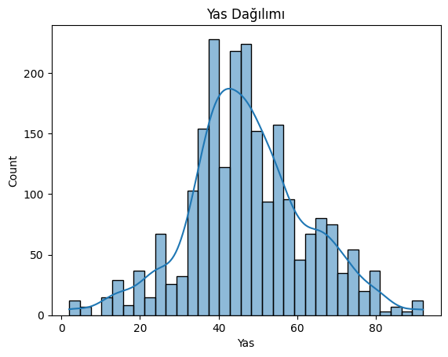
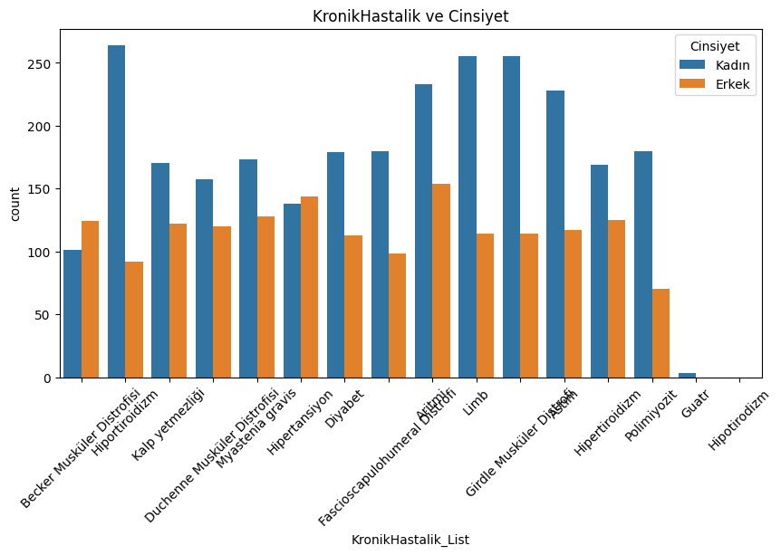
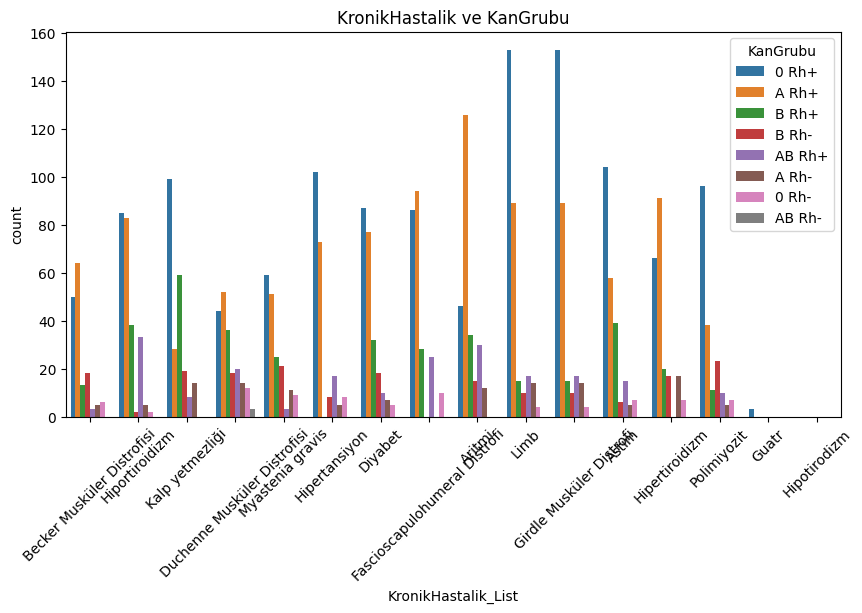
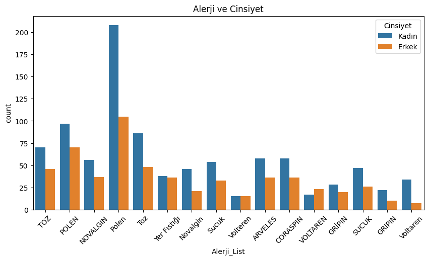
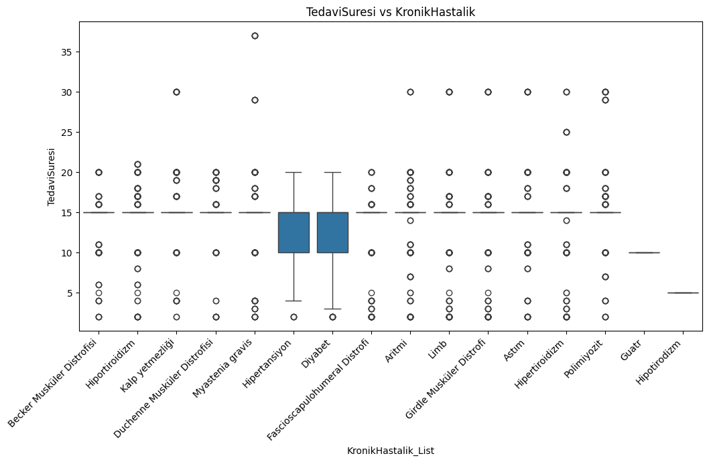
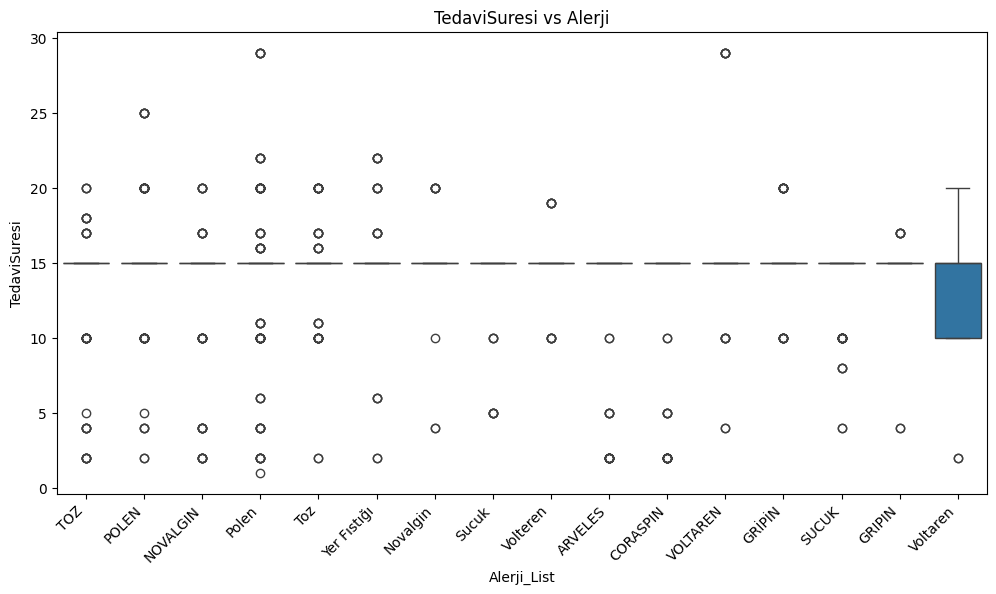
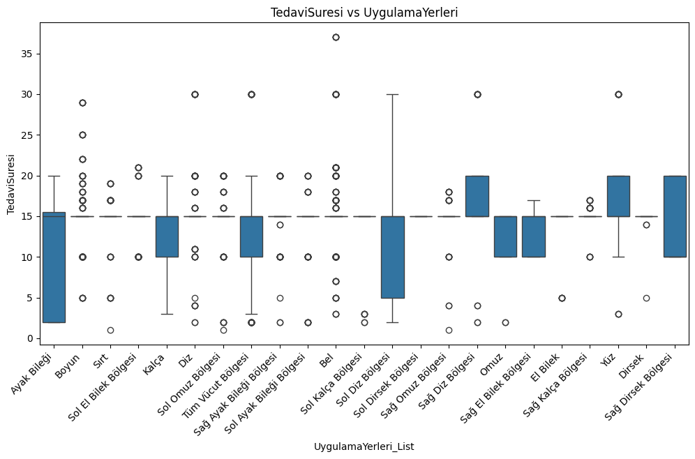
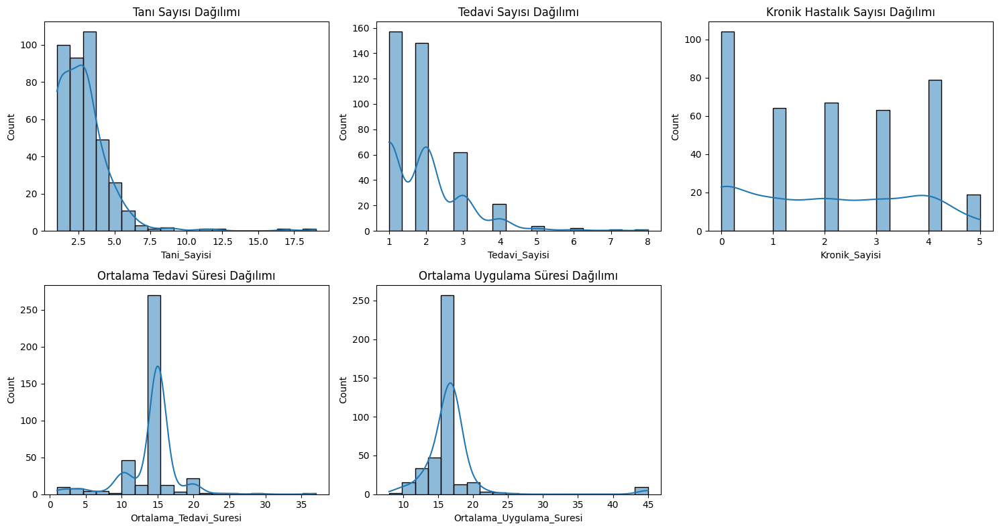

# FİZİKSEL TIP VE REHABİLİTASYON ANALİZİ — CASE RAPORU

**Ad Soyad:** Buse Yetkin  
**E-posta:** ytkn.bs@gmail.com

## 1. Özet
Bu raporda, fiziksel tıp ve rehabilitasyon veri seti üzerinde gerçekleştirilen keşifsel veri analizi (EDA), veri temizleme (preprocessing) ve temel feature engineering çalışmaları özetlenmiştir. Amaç, veri setini modellemeye hazır hâle getirmektir.

## 2. Veri Seti Hakkında
Veri setinin boyutu 2235,13 olarak gözlemlenmiştir. 2 sayısal değişken, 11 kategorik değişken bulunmaktadır.

Sayısal değişkenler: HastaNo, Yas, TedaviSuresi, UygulamaSuresi (TedaviSuresi ve UygulamaSuresi sonradean sayısal hale getirilmiştir).  
Kategorik değişkenler: Cinsiyet, KanGrubu, Uyruk, KronikHastalik, Bolum, Alerji, Tanilar, TedaviAdi, UygulamaYerleri

## 3. EDA Sonuçları
- Yaş dağılımı incelendi; en yoğun grup 40–50 yaş aralığıdır.  

- Kategorik değişkenlerin dağılımları incelenirken bazı sütunlarda çok fazla benzersiz değer bulunduğu için doğrudan countplot'lar okunaklı sonuç vermedi. Özellikle: KronikHastalik, Tanilar, TedaviAdi, UygulamaYerleri. Bu nedenle bu sütunlar önce ayrıştırıldı (multi-etiketler explode edildi), ardından en sık görülen alt kümeler ile grafikler oluşturuldu.  
- İlişki analizleri (kategori vs. kategori, kategori vs. hedef) sonucunda gözlemler:
  - Kronik hastalıkların kadınlarda daha sık görüldüğü tespit edildi.  
  
  - 0 Rh+ ve A Rh+ kan gruplarında kronik hastalıkların daha yaygın olduğu görüldü.  
  
  - Alerji oranı kadınlarda daha yüksek bulundu.  
  
  - Tedavi süresi (etiketler halinde) kadınlarda biraz daha yüksek seyretti.  
  - Hipertansiyon ve diyabet tanılı hastalarda tedavi süreleri çoğunlukla 10–15 seans aralığında yoğunlaştı.
    
  - Voltaren alerjisi olanlarda tedavi süresi genellikle 10–15 aralığında yoğunlaştı.  
  
  - Uygulama yerlerine göre tedavi sürelerinin farklı dağıldığı gözlendi.
  
- Genel korelasyon analizinde (encode ve preprocessing sonrasında) güçlü (>0.8) korelasyonlar gözlenmedi.
- Değişken değerlerinde çok fazla sayıda yazım hataları tespit edildi.
- Bir değişkende aynı değerin iki kere yazıldığı tespit edildi. (ör. Toz-TOZ)
- Hasta bazlı değişken dağılımlarına bakıldı. (ör. bir hastaya konulan tanının genel olarak 2-4 civarında olduğu, kronik hastalıkların en çok 0 ve 4 olması vb.)

**Eksik değer özet tablosu**

| Değişken           | Eksik Değer Toplamı | Eksik Değer Yüzdesi (%) |
|--------------------|---------------------:|------------------------:|
| Cinsiyet           | 169                  | 7.56                    |
| KanGrubu           | 675                  | 30.20                   |
| KronikHastalik     | 611                  | 27.34                   |
| Bolum              | 11                   | 0.49                    |
| Alerji             | 944                  | 42.24                   |
| Tanilar            | 75                   | 3.36                    |
| UygulamaYerleri    | 221                  | 9.89                    |

## 4. Veri Temizleme (Preprocessing) — Yapılanlar
Aşağıdaki adımlar kalıcı olarak veri setine uygulandı:

1. **Yazım hatalarının düzeltilmesi**
   - Multi-etiketli sütunlarda (örn. Tanilar, TedaviAdi, Alerji, KronikHastalik, UygulamaYerleri) görülen büyük/küçük harf farkları, görünmez karakterler vb. hatalar normalleştirildi.
   - Özel karakterler temizlendi, fazla boşluklar giderildi.
   - Manuel eşleştirme sözlüğü (ör. volteren → voltaren, hiportiroidizm → hipotiroidizm) kullanılarak doğrulamalar yapıldı.
   - Tespit edilen onur, xx anlamsız girdileri veri setinden kaldırıldı.

2. **Eksik değerlerin doldurulması**
   - HastaNo bazlı doldurma: aynı hasta içinde bazı satırlarda mevcut olan bilgiler (ör. Cinsiyet) boş olan satırlara dolduruldu (ffill + bfill).
   - HastaNo + TedaviAdi bazlı doldurma: UygulamaYerler` için aynı hasta ve tedavi kombinasyonunda dolu olan değerler boş satırlara aktarıldı.
   - Bolum sütunundaki 11 eksik değer tek bir hastaya ait olduğundan, o hastanın tanı ve tedavi bilgileri göz önünde bulundurularak Fiziksel Tıp Ve Rehabilitasyon ile dolduruldu.
   - Cinsiyet ve KanGrubu'nda kalan eksikler, sütunların en sık görülen değeri (mode) ile dolduruldu.
   - Tanilar ve UygulamaYerleri için KNNImputer kullanıldı. KNN öncesinde ilgili kategorik sütunlar label-encoder ve one hot encoder ile sayısala çevrildi.

3. **Kategorik değişkenlerin kodlanması**
   - Cinsiyet: Kadın = 1, Erkek = 0 olarak binary kodlandı.
   - Az eşsizliğe sahip kategoriler (KanGrubu, Uyruk, Bolum): OneHotEncoder uygulandı.
   - Çok sayıda eşsiz değere sahip kategoriler (KronikHastalik, Tanilar, TedaviAdi, UygulamaYerleri, Alerji): LabelEncoder ile sayısala dönüştürüldü (KNNImputer ve bazı modeller için uygun hale getirildi).

4. **Sayısal değişkenlerin ölçeklenmesi**
   - Yas: StandardScaler ile standartlaştırıldı (ortalama 0, std 1).
   - TedaviSuresi ve UygulamaSuresi: MinMaxScaler ile 0–1 aralığına normalleştirildi.

Tüm bu işlemler sonucunda veri setinde eksik değer kalmadı ve tüm değişkenler modelleme için uygun forma getirildi.

## 5. Feature Engineering (Oluşturulan Yeni Değişkenler)
Veri setine aşağıdaki özet değişkenler eklendi:

1. **Toplam_Tani** — Her hasta için benzersiz tanı sayısı (groupby("HastaNo")["Tanilar"].nunique() ile oluşturuldu).  
2. **Toplam_Tedavi** — Her hasta için benzersiz tedavi sayısı (groupby("HastaNo")["TedaviAdi"].nunique() ile oluşturuldu).  

Bu yeni değişkenler, hastanın durumunun özetini sunar ve hedef değişken olan TedaviSuresi ile ilişki analizlerinde fayda sağlar.

## 6. Özet Bulgular ve Yorum
- Veri temizliği ve ön işleme adımları tamamlandı; eksik değerler dolduruldu ve yazım hataları büyük ölçüde giderildi.  
- Kategorik değişkenlerin bir kısmı yüksek kardinaliteye sahip olduğundan label encoding tercih edildi; az kardinaliteye sahip olanlar için one-hot uygulandı.  
- Elde edilen korelasyon analizi güçlü bağıntılar göstermedi; bu durum veri yapısı ve değişkenlerin doğasından kaynaklanıyor olabilir.  
- Oluşturulan özet değişkenler (Toplam_Tani, Toplam_Tedavi) modelleme aşamasında açıklayıcı olabilecek ek bilgiler sunar.
